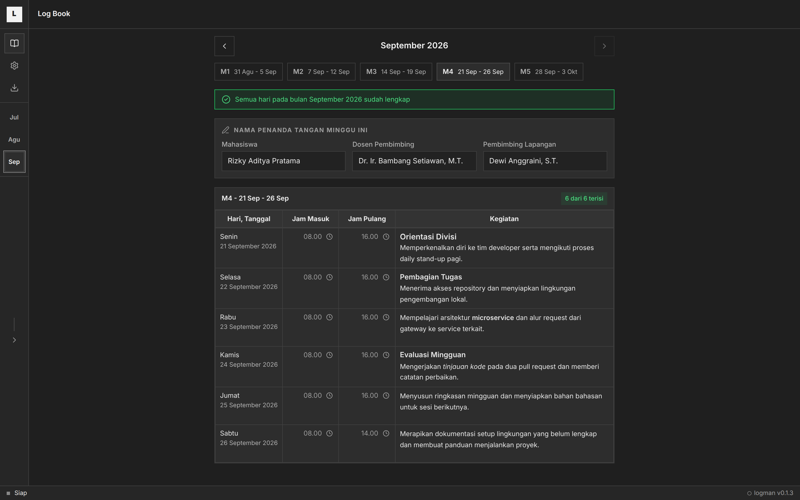
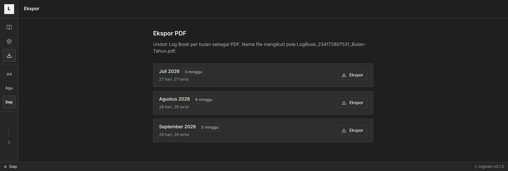
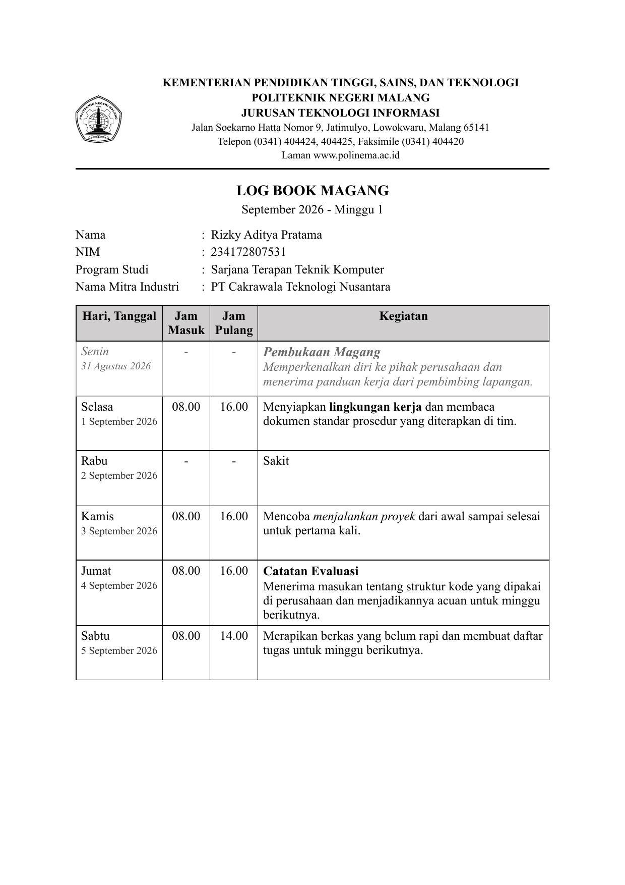

# logman

An internship Log Book generator. A local web app for writing daily internship
activities, editing them in place like a document, and exporting a print-ready PDF
that is ready to sign.



## Highlights

- Edit the Log Book directly in an A4 document table, one cell per day.
- Bold, italic, and headings inside the activity cell, with `Ctrl+B` and `Ctrl+I`.
- Choose which weekdays get a row, from Monday to Saturday down to Monday to Friday.
- Custom reasons for empty days, each one able to strip the time columns.
- Nine themes, a 12 or 24 hour clock, and a content scale for the document.
- Reject export while any day is missing both an activity and a reason.
- Export one PDF per month, complete with the campus letterhead and signature block.

## Requirements

- Node.js 20 or newer
- pnpm 9 or newer
- Chromium for PDF export (installed automatically by Playwright)

## Getting started

The launcher installs dependencies when needed, then starts the web app and the API
together. Pick the row that matches your platform:

| Platform | Shell | Command |
| --- | --- | --- |
| Linux, macOS, WSL | any | `./run` |
| Windows | Command Prompt | `run.cmd` |
| Windows | PowerShell | `.\run.ps1` |
| macOS | Finder | double-click `packaging/Logman.command` |
| Windows | Explorer | double-click `packaging/Logman.bat` |
| Linux | desktop menu | run `packaging/install-desktop.sh` once |

- Web: http://127.0.0.1:5199
- API: http://127.0.0.1:5198

If either port is already taken, the dev server moves to the next free port and
prints the new URLs on startup. Web and API are always chosen together, so the
proxy and the API can never drift apart.

Every launcher forwards its arguments to the `pnpm` script of the same name, so a task
works the same way on all platforms. These are equivalent:

```bash
./run test          # Linux, macOS, WSL
run.cmd test        # Windows Command Prompt
.\run.ps1 test      # Windows PowerShell
```

Available tasks:

```bash
./run build       # typecheck + production build
./run lint        # lint and format check (Biome)
./run typecheck   # TypeScript type check
./run test        # unit tests (Vitest: domain + components + server)
./run test:e2e    # end-to-end tests (Playwright, needs Chromium)
./run analyze     # build + bundle budget check
```

Focused scripts for faster debugging:

```bash
./run test:domain        # domain logic only
./run test:server        # server only
./run test:e2e:editor    # a single e2e spec, for example editor
./run audit:motion       # animation rules
./run audit:a11y         # accessibility across every page and theme
./run screenshots        # regenerate the images in this file
```

`./run <argument>` forwards to the `pnpm` script of the same name, so
`./run test:e2e:seed` and `./run test:e2e:perf` work as well, on every platform.

`./run screenshots` writes the images to `docs/screenshots/`. It fills the app with
fictional sample data in a throwaway data directory, so it never touches your own Log
Book.

## Pages

- `/` Log Book: month and week navigation, in-place per-cell editing, per-week
  signatory names (student, supervising lecturer, field supervisor), and a content
  display scale.
- `/settings` Settings: profile, internship period, default hours (including a 12 or
  24 hour clock), working days, field supervisor list, empty-day reasons with an
  option to strip the time per reason, theme, paper size, document font (Times New Roman
  or Arial), content scale, export folder via a native folder dialog, motion tier,
  interface language, and the dev UI toggle. A search box at the top matches both section
  names and the text inside each section, highlights the matched word, and jumps to the
  section you pick.
- `/export` Monthly PDF export. Export is refused while any day is incomplete, meaning
  it has neither an activity nor a reason.
- `/dev/components`, `/dev/motion`, `/dev/perf`, `/dev/seed`: development pages for
  testing and measurement. The menu and these pages are reachable only when "Show Dev
  menu" is enabled in Settings (off by default).

## Screenshots

Every image below is generated by `./run screenshots` and uses fictional sample data.

Monthly export. Each month is checked for completeness before it can be exported.



The first page of an exported PDF. The letterhead, table, and day names follow the
campus template, and the text formatting from the editor is carried over.



## Language

The interface ships in Indonesian and English. Switch it under Settings, then
Language. The default is Indonesian, and the choice is stored in the configuration.

Printed documents and exported PDFs always stay in Indonesian. The letterhead, table
headers, day and month names, and signature block follow the campus template, so they
are deliberately not translated.

## Data

Runtime data is stored locally and is not tracked by git:

- `data/config.json`: profile, internship period, default hours, time format,
  document font, content scale, field supervisor list, reasons, theme, paper size,
  motion tier, interface language, dev UI toggle.
- `data/logs.json`: daily activity entries and per-week signatory names.
- `data/backups/`: rotating backup taken before a write.
- `data/logs/`: application logs as JSON lines with a `traceId`.
- `data/exports/`: generated PDFs when `folderExport` is empty.

## Documentation

Every rule, design decision, and convention lives in [AGENTS.md](./AGENTS.md). Read it
before changing anything. Current progress is tracked in section 20 of that document.

## Releases

Releases are cut from git tags. The workflow builds the production bundle and verifies
the bundle budget, then publishes a GitHub Release with auto-generated notes. For users
who prefer a launcher over the terminal, double-click `packaging/Logman.command` on macOS
or `packaging/Logman.bat` on Windows, and run `packaging/install-desktop.sh` once on
Linux to add a menu entry.

## License

The code is licensed under the Apache License 2.0. See [LICENSE](./LICENSE) for the
full terms and [NOTICE](./NOTICE) for the attribution requirements.

Anyone who uses, copies, modifies, or redistributes this code must keep the `LICENSE`
and `NOTICE` files, credit the original author and the source URL
(<https://github.com/Khip01/logman>), state that the work is derived from logman, and
mark any file they changed. Those duties come from sections 4(a) to 4(d) of the
Apache License 2.0.

### Assets that are not covered

Three things in this repository are **not** covered by the license and remain the
property of their rightsholders:

- `public/letterhead-polinema.png`, the Politeknik Negeri Malang emblem. It was
  extracted from the campus' official document template and the author does not own it.
- The letterhead text printed into documents and PDFs, whose wording and layout follow
  the campus' official format.
- The name and emblem of Politeknik Negeri Malang generally.

They are shipped here for the convenience of students of that campus and must not be
redistributed as part of a derived work without permission. If you are not a student
of that campus, replace the letterhead and emblem with your own before using this for
official purposes.

